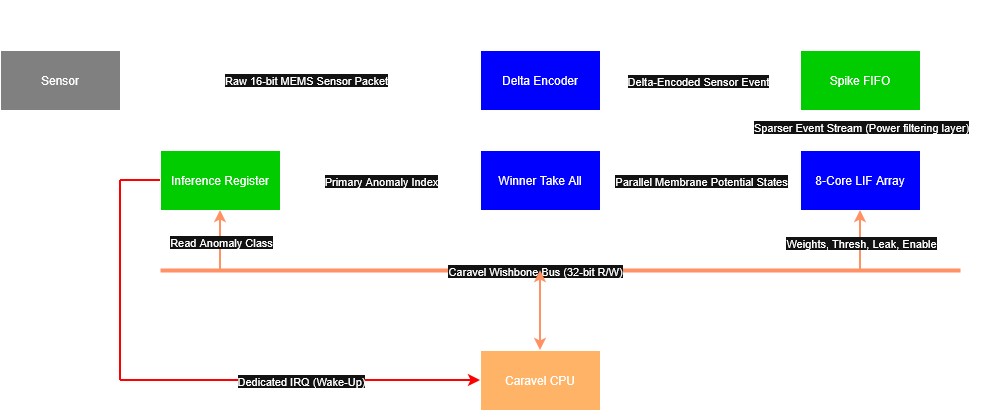

<div align="center">


[](https://git.io/typing-svg)

[](https://opensource.org/licenses/Apache-2.0)
[](https://platform.chipfoundry.io/marketplace)

</div>

## Table of Contents
- [Sentry-AI Overview](#sentry-ai-overview)
- [Real Deployment Scenario](#real-deployment-scenario)
- [System Architecture](#system-architecture)
- [Design Philosophy & Power Story](#design-philosophy--power-story)
- [Software-Defined Memory Map](#software-defined-memory-map)
- [Firmware Integration Example](#firmware-integration-example)
- [Verification & Proof](#verification--proof)
- [Repository Structure](#repository-structure)
- [ChipFoundry & Caravel Toolchain Guide](#chipfoundry--caravel-toolchain-guide)

---

## Sentry-AI Overview
**Sentry-AI is an ultra-low-power, event-driven neuromorphic anomaly detection accelerator designed for the SKY130 node.**

Traditional edge IoT monitoring relies on MCUs continuously sampling sensors, computing FFTs, and running ML models, burning tens of milliwatts to process mostly empty noise.

**Sentry-AI flips the paradigm.** It features an 8-core Leaky Integrate-and-Fire (LIF) array that sits between the sensor and the MCU. The CPU configures the feature weights and immediately goes to deep sleep. Sentry-AI passively ingests delta-encoded sensor streams, remaining completely idle until a specific vibrational threshold is crossed over a temporal window. Only then does it compute the Winner-Take-All inference and fire a hardware interrupt to wake the MCU.

**The Result:** Micro-watt power consumption, zero software overhead during monitoring, and instant anomaly classification.

---

## Real Deployment Scenario
**Example Deployment: Industrial Vibration Sensor Node**

To visualize Sentry-AI in a production environment, consider a battery-powered predictive maintenance node on a factory floor:

- **Sensor:** A MEMS accelerometer (e.g., ADXL345) continuously monitoring a motor chassis.
- **Edge Accelerator:** Sentry-AI ASIC.
- **Host:** Caravel SoC (RISC-V).
- **Operation:** The ADXL345 feeds raw data to Sentry-AI. The RISC-V core remains in a `wfi` (Wait For Interrupt) deep sleep state. Sentry-AI filters standard operating noise and tracks anomalies over time. If a high-frequency signature crosses the critical threshold, Sentry-AI latches the interrupt, waking the RISC-V core to immediately transmit an alert via LoRa or WiFi.
- **Estimated Power Budget:**
  - Idle monitoring: < 1 mW
  - Event processing (anomaly detected): ~few mW

---

## System Architecture



```text
+---------------------+
|   Sensor / ADC      |
+----------+----------+
           | (Raw 16-bit Data)
           v
+---------------------+
| Delta Event Encoder |  <-- Filters out normal noise to save power
+----------+----------+
           | (Sparse Events)
           v
+---------------------+
|     Spike FIFO      |  <-- Decouples fast sensor from slow math
+----------+----------+
           |
           v
+---------------------------+
| 8-Core LIF Neuron Array   |  <-- Hardware bit-shift feature extraction
| (Temporal Window active)  |
+----------+----------------+
           |
           v
+---------------------+
| Winner Take All     |  <-- Hardware Priority Encoder
+----------+----------+
           |
           v
+---------------------+
| Inference Register  |  <-- Latched Status Flags
+----------+----------+
           | (IRQ)
           v
+---------------------+
| Caravel RISC-V CPU  |
| (WFI until IRQ)     |  <-- Zero dynamic power during monitoring
+---------------------+
```

## Design Philosophy & Power Story

- **Shift-Add over MAC:** Instead of area-expensive 32-bit multipliers, Sentry-AI uses bit-shifts (`sensor_value << shift_amount`) for feature extraction. This achieves near-zero hardware cost, reduced switching power, and easier timing closure in SKY130.
- **Temporal Spike Integration:** Neurons integrate spikes over programmable windows. A global tick prescaler converts the high-frequency system clock into a slower time reference, allowing the hardware to detect patterns like periodic vibration, acoustic anomalies, or mechanical faults over time.
- **Sticky Interrupts:** The hardware IRQ line stays asserted across infinite clock cycles until explicitly cleared by a firmware read, ensuring the CPU never sleeps through a critical anomaly.
- **Power Gating:** Firmware can dynamically disable specific neurons via the `ENABLE_MASK` during idle monitoring modes, enabling adaptive power scaling.

## Software-Defined Memory Map

Sentry-AI is fully programmable via the Caravel Wishbone interface.

Base Address: `0x30000000` (Caravel User Project Address Space)

| Address | Register | Access | Description |
|---|---|---|---|
| `0x00` | `GLOBAL_THRESH` | R/W | Neuron firing threshold |
| `0x04` | `LEAK_RATE` | R/W | Potential decay per temporal tick |
| `0x08` | `ENABLE_MASK` | R/W | Active neuron power-gate mask |
| `0x0C` | `TICK_LIMIT` | R/W | Temporal integration prescaler |
| `0x10-0x2C` | `WEIGHT_0-7` | R/W | Shift-based weights (Bits `[3:0]` = Shift, `[31:4]` = Reserved) |
| `0x30` | `INFERENCE_RES` | R | Winner neuron index |
| `0x34` | `SPIKE_STATUS` | R/C | Latched spike flags (clear on read) |

## Firmware Integration Example

Sentry-AI acts as a smart driver for the RISC-V core. Below is an example of the initialization and sleep sequence:

```c
#include "sentry_ai.h"
#include <stdio.h>

void irq_handler() {
    uint32_t anomaly_type = SENTRY_INFERENCE_RES;
    uint32_t raw_spikes   = SENTRY_SPIKE_STATUS; // Reading auto-clears the latched interrupt

    printf("URGENT: Sentry-AI Interrupt Fired! Class: %d\n", anomaly_type);
    if (anomaly_type == 7) {
        printf("ACTION: Critical High-Frequency Failure! Shutting down motor.\n");
    }
}

void init_sentry_ai() {
    SENTRY_ENABLE_MASK = 0x00; // Disable neurons during config
    uint32_t clear_dummy = SENTRY_SPIKE_STATUS; // Clear residual hardware flags

    // Configure temporal integration and thresholds
    SENTRY_GLOBAL_THRESH = 5000;
    SENTRY_LEAK_RATE = 2;
    SENTRY_TICK_LIMIT = 100000; // 1 millisecond temporal window at 100 MHz

    // Configure feature extractors (shift-add weights)
    SENTRY_WEIGHT_0 = 0; // 1x multiplier (baseline rumble)
    SENTRY_WEIGHT_7 = 5; // 32x multiplier (high-frequency anomaly)

    // Arm the system
    SENTRY_ENABLE_MASK = 0x81; // Enable neurons 0 and 7
    printf("Sentry-AI armed. CPU entering deep sleep...\n");
}

void main() {
    init_sentry_ai();
    while (1) { asm("wfi"); /* Wait For Interrupt */ }
}
```

## Verification & Proof

The design has undergone rigorous verification to ensure contest-ready silicon reliability:

- **RTL Simulation:** Functional verification of the 8-core array and Winner-Take-All logic using Icarus Verilog.
- **Gate-Level Simulation (GLS):** Post-synthesis verification ensuring timing and logical correctness within the SKY130 PDK.
- **Wishbone Register Verification:** Read/Write compliance testing for the Caravel memory map.
- **Temporal Integration Validation:** Proof of millisecond-scale spike accumulation and leak mechanics.

### Temporal Integration Waveform

(The step-accumulation of the membrane potential against the leak tick, resulting in a spike and latched IRQ.)

## Repository Structure

```text
├── openlane/                   # Hardening configurations
├── verilog/
│   ├── rtl/
│   │   ├── user_project_wrapper.v  # Top-level Caravel macro
│   │   ├── user_proj_example.v     # Sentry-AI Core & Manager
│   ├── dv/
│   │   ├── tb_advanced.v           # Testbenches & temporal validation
├── firmware/
│   ├── main.c                      # RISC-V Integration
│   ├── sentry_ai.h                 # Memory map headers
├── images/                         # Architecture & waveform PNGs
└── README.md
```

## ChipFoundry & Caravel Toolchain Guide

(The following sections contain the standard documentation for reproducing this build using the ChipFoundry OpenLane and Caravel flows.)

### Documentation & Resources

- Caravel Datasheet
- Caravel Technical Reference Manual (TRM)

### Prerequisites

- Docker Linux | Windows | Mac
- Python 3.8+ with pip
- Git for repository management

### Starting Your Project

```bash
pip install chipfoundry-cli
cd <project_name>
cf init
cf setup
```

(Note: `cf setup` installs Caravel Lite, the Management Core, OpenLane, the SKY130 PDK, and timing scripts.)

### Development Flow

Hardening the design:

```bash
cf harden --list                   # List detected configurations
cf harden <macro_name>             # Harden a specific macro
cf harden user_project_wrapper     # Harden the top level
```

GPIO configuration (required before verification or precheck):

```bash
cf gpio-config
```

Verification:

```bash
cf verify <test_name>           # RTL simulation
cf verify <test_name> --sim gl  # Gate-level simulation
cf verify --all                 # Run all tests
```

### Local Precheck & Checklist for Shuttle Submission

Ensure your design complies with all shuttle requirements:

```bash
cf precheck
```

- [x] Top-level macro is named `user_project_wrapper`.
- [x] Full chip simulation passes for both RTL and GL.
- [x] Hardened macros are LVS and DRC clean.
- [x] `user_project_wrapper` matches the required pin order/template.
- [x] Design passes the local `cf precheck`.
- [x] Documentation (`README.md`) is updated with project-specific details.